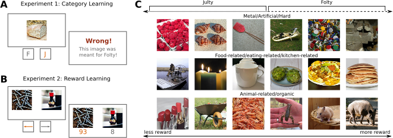

# Read Me!

> Code for the project “Language Aligned Visual Representations Predict
> Human Behavior in Naturalistic Learning Tasks”

<!-- WARNING: THIS FILE WAS AUTOGENERATED! DO NOT EDIT! -->

### Abstract

> Humans possess the ability to identify and generalize relevant
> features of natural objects, which aids them in various situations. To
> investigate this phenomenon and determine the most effective
> representations for predicting human behavior, we conducted two
> experiments involving category learning and reward learning. Our
> experiments used realistic images as stimuli, and participants were
> tasked with making accurate decisions based on novel stimuli for all
> trials, thereby necessitating generalization. In both tasks, the
> underlying rules were generated as simple linear functions using
> stimulus dimensions extracted from human similarity judgments.
> Notably, participants successfully identified the relevant stimulus
> features within a few trials, demonstrating effective generalization.
> We performed an extensive model comparison, evaluating the
> trial-by-trial predictive accuracy of diverse deep learning models’
> representations of human choices. Intriguingly, representations from
> models trained on both text and image data consistently outperformed
> models trained solely on images, occasionally even surpassing models
> using the features that generated the task itself. These findings
> suggest that language-aligned visual representations possess
> sufficient richness to describe human generalization in naturalistic
> settings and emphasize the role of language in shaping human
> cognition.



## Setup

I ran the analyses on a cluster system that used a SLURM job scheduler
and a singularity image. Therefore the bash and slurm scripts are
specific to that system. However, the singularity image is available on
dockerhub and can be run locally using the following command:

``` bash
docker pull candemircan/naturalcogsci:latest
```

If you want to use the singularity image, you can pull it as follows

``` bash
singularity pull NaturalCogSci.sif docker://candemircan/naturalcogsci:latest
```

If you do not want to use containers, you can install the Python
dependencies as follows:

``` bash
git clone https://github.com/candemircan/NaturalCogSci.git
cd NaturalCogSci
pip install -r requirements.txt
pip install -e .
```

For the versions of R dependencies, you can see the `DOCKERFILE`

## Environment Variables

The code uses the environment variable `NATURALCOGSCI_ROOT` to determine the root directory of the project. You can set this variable in your `.bashrc` file (or whatever your shell rc file might be) as follows:

```bash
export NATURALCOGSCI_ROOT=/path/to/NaturalCogSci
```

For me, R could not read this variable from the shell, so I had to set it in the `~/.Renviron` file as well.

## Experiments

Both experiments are shared under the `experiments` folder. See the
`README.md` files in the respective folders for more information.

## Data

The data is shared in an OSF repository. It should be put under the `data` folder, if you want to use the code as is. All the behavioural (anaonymised) and modelling data can be found in the OSF repo. Further detail about the data are found under the `README.md` file in the `data` folder.	

The OSF repository is here: https://osf.io/h3t52/